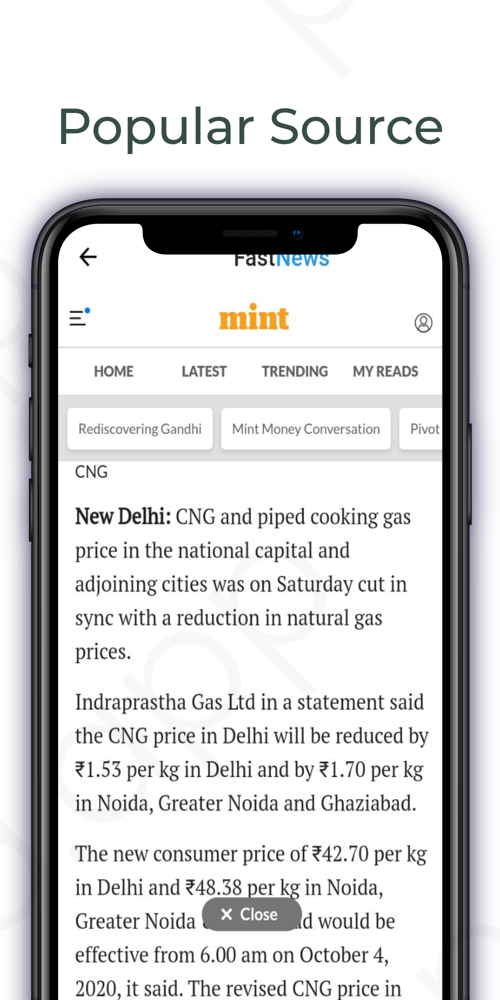

# FastNews

This is a Flutter Based simple News Application.

# Screenshots
&nbsp;&nbsp;&nbsp;&nbsp;&nbsp;

  

# Setup

First thing first login to [newsApi.org](https://newsapi.org/). 
Get your API key. 
Clone this repository.
 Paste keys inside lib/keys/key.dart 
Hit run. :)

# Splash Screen Edit
To replace the icon on the splash screen: 
1) Add image name in pubsec.yaml under flutter_native_splash
2) Run flutter pub pub run flutter_native_splash:create

# Let's discuss
  
  [Telegram Group](https://t.me/joinchat/OKSLQBoBNquemTZD4gO9sQ) 

# Open For Hacktoberfest

This repository is open for hacktoberfest. Kick start your Open Source journey. Happy Coding :)

